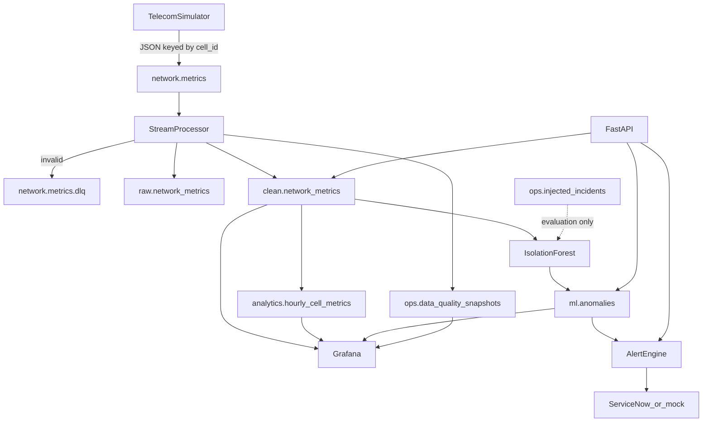

# Architecture

## Pipeline

## Why each piece exists

- **Simulator** — stand-in for OSS/probe feeds. Correlated physics so congestion looks like congestion, not noise.
- **Kafka** — decouples produce from store; enables replay, backpressure, and per-cell ordering (`key = cell_id`).
- **Processor** — schema/range checks, unknown `cell_id` rejection, batch inserts, offset commit **after** a successful DB write (at-least-once + unique `(cell_id, event_ts)`).
- **PostgreSQL layers** — `raw` is the audit log; `clean` is typed facts; `analytics` is cheap Grafana/SQL; `ops` holds topology, quality, and hidden incident labels; `ml` holds scores.
- **Batch ETL** — hourly/daily rollups. In production this job would be Airflow/Dagster; here it is a loop.
- **Isolation Forest** — multivariate outliers vs **cell baselines**. A rural 4G cell at 80 ms can be normal; urban 5G at 80 ms is not.
- **Grafana** — two boards on purpose: network health **and** pipeline health.
- **Alert engine / FastAPI** — optional. Rules explain anomalies; HIGH/CRITICAL go to a ServiceNow sink (mock by default). Removing these services does not stop ingest.

## Kafka

| Topic | Partitions | Key | Purpose |
|---|---|---|---|
| `network.metrics` | 6 | `cell_id` | telemetry |
| `network.metrics.dlq` | 3 | `cell_id` | invalid / poison messages |

Consumer group: `metrics-processor`. JSON serialization. Producer: `acks=all`, idempotent.

## Delivery semantics

At-least-once consume. Duplicates are absorbed by `PRIMARY KEY (cell_id, event_ts)` on `clean.network_metrics`. Invalid records never disappear: they go to the DLQ topic and `ops.invalid_records`.

## Incident labels

`ops.injected_incidents` is written by the simulator over a DB side channel. Kafka payloads never include `incident_type`. That matches production (labels are not on the probe stream) and keeps ML evaluation honest.

## What was deliberately left out

Spark, Flink, Airflow, dbt, Kubernetes, Avro, cloud warehouses, FastAPI, ServiceNow, LLMs. Volume is ~10 events/s; those tools would not teach more than they would hide.

## Scale-up talking points

- 50k cells: raise partitions, add consumer instances in the same group, consider TimescaleDB or a real warehouse for long-range scans.
- Schema evolution: Avro + Schema Registry.
- Exactly-once: Kafka transactions + idempotent sink (already unique-keyed).
- Orchestration: Airflow for the batch job; keep the stream in Kafka.
